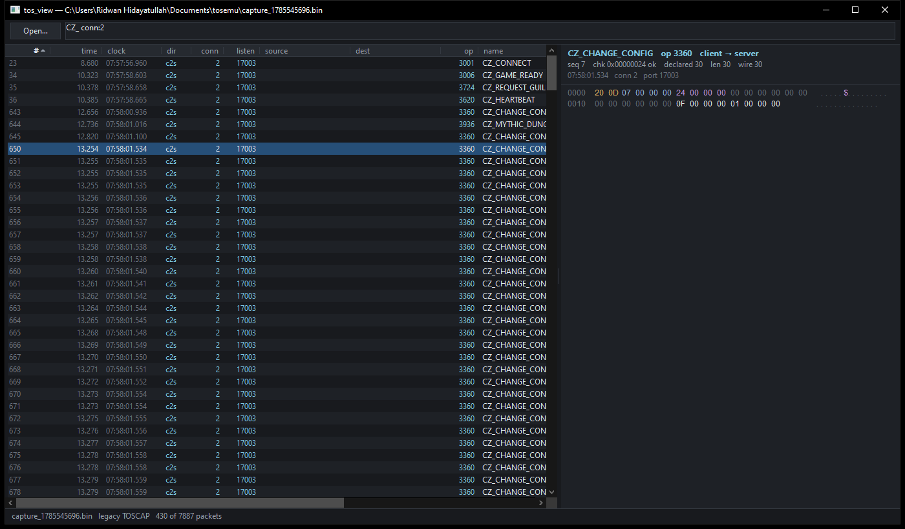

# tos_view

Browse a packet dump: sortable table on the left, the selected packet's bytes
on the right.



## Build

```bash
cmake -S cpp/viewer -B cpp/viewer/build -G Ninja && cmake --build cpp/viewer/build
```

or, without CMake (the manifest is not optional — it is what turns on Common
Controls v6 and per-monitor DPI):

```bash
windres cpp/viewer/app.rc -O coff -o app.res && g++ -std=c++17 -O2 -municode -mwindows -o tos_view.exe cpp/viewer/*.cpp app.res -lcomctl32 -luxtheme -lgdi32 -lcomdlg32 -lshell32 -static
```

## Run

```bash
tos_view.exe relay\dumps\capture_20260801_205300.bin
```

Or start it with no arguments and use **Open…** / `Ctrl+O`, or drop a file on
the window.

Both dump formats open: `TOSRLY` from `cpp/relay`, and the older `TOSCAP` from
`cpp/tos_capture`. TOSCAP records carry no addresses and no packet names, so
those columns come up empty and the names are read from `packet_opcodes.csv`
(looked for beside the dump, beside the exe, and a few directories up from
either).

## Table

Every column sorts — click the header, click again to reverse. Addresses sort
by value rather than by their text, so `52.5.58.238` does not land between
`52.40.…` and `52.6.…`.

Rows are tinted by direction: client→server one colour, server→client the
other, a failed checksum in red. The table is virtual, so a capture of any size
opens at once and filtering costs one pass, not a rebuild.

Packets whose opcode is not in `packet_opcodes.csv` are drawn in amber and
carry a `flag` — `new-op` when the packet was framed anyway (every client
packet is, since its frame carries a length), `unframed` when the bytes could
not be framed at all, `len?` when the length was inferred from where the next
valid packet started. Those rows are usually why the capture was taken;
`flag:new` brings up just them.

## Filter

Space-separated terms, ANDed. A bare term matches the packet name or the
opcode; `field:value` matches that field; a leading `-` negates. Anything
unparseable is treated as text, so a half-typed term narrows instead of
erroring.

| | |
|---|---|
| `ZC_MOVE` | name contains ZC_MOVE |
| `3106` | that opcode, or a name containing it |
| `dir:c2s` `dir:s2c` | direction |
| `op:3106` `op:0xC22` | opcode, decimal or hex |
| `conn:2` | one connection |
| `link:zone` | `barrack`, `zone`, `social` |
| `ip:52.5.58.238` | either address |
| `port:7001` | listen, source or destination port |
| `len>100` `len<50` `len:22` | body length |
| `chk:bad` `chk:ok` `chk:?` | checksum verification |
| `seq:7` | sequence number |
| `flag:new` | opcode is not in `packet_opcodes.csv` |
| `flag:unframed` | bytes the relay could not frame |
| `flag:inferred` | length taken from the next valid packet |
| `-chk:ok` | negate any term |

`Ctrl+F` jumps to the box, `Esc` clears it.

## Hex panel

The wire header is shaded rather than left for you to count: opcode, sequence
and checksum each get a colour, the twelve bytes a client packet carries and
the server ignores are greyed, and a variable packet's inline size field is
marked. Those four are where nearly every misreading of this protocol starts
(`docs/11-packet-framing.md`).

Click a byte and the status bar shows its offset and the u8/u16/u32/f32 that
start there — enough to check a field offset against `packet_schema.json`
without leaving the window. Arrow keys move the caret; `Ctrl+C` copies the
packet as a text hexdump.

`Ctrl+C` with the table focused copies the selected rows as TSV instead.

## Notes

The split between the panels is draggable. The dark title bar needs Windows 10
1809 or newer; on anything older the frame stays light and everything else is
unchanged.
